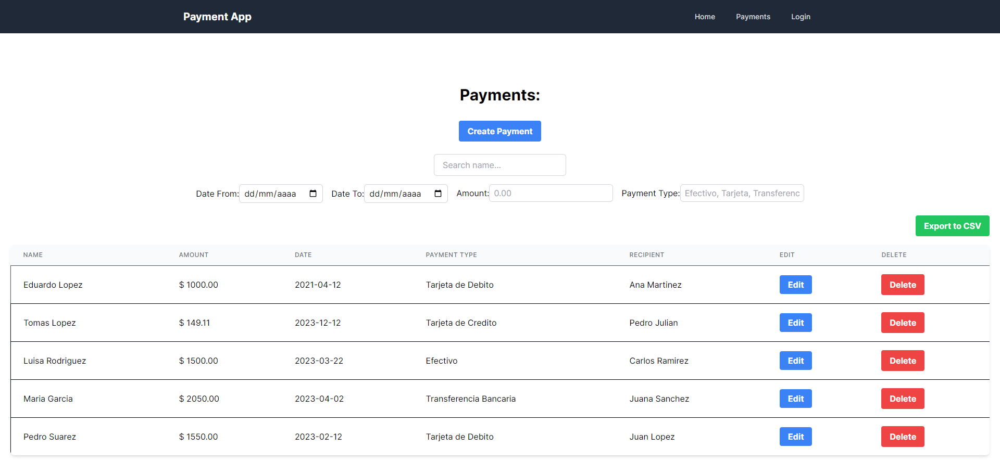

# Banking Payments Management Website

This website provides a platform for registering, managing, and querying customers' banking payments. It offers intuitive and secure features for CRUD (Create, Read, Update, Delete) operations on payments, as well as filtering and search options for better information management.

## Key Features:

- **Payment Registration:** Users can register new payments by entering details such as amount, date, payment type, and recipient.
  
- **View and Manage:** Users have access to a comprehensive list of payments made, with options to edit, delete, and add new payments as needed.
  
- **Filtering and Searching:** Filtering functionality to quickly access specific payments based on criteria such as date, amount, payment type, etc. Additionally, a search bar is provided to search for payments by specific terms.
  
- **Export to CSV:** Users can export the list of payments to a CSV or Excel file for further analysis or reporting.

- **User Authentication:** Implementation of basic authentication using sessions to ensure the security and privacy of user data.

## Technical Requirements:

- **Backend:** Developed with Node.js and Express, providing a RESTful API to handle CRUD operations on payments, using PostgreSQL as the database for storing payment information.

- **Frontend:** Utilizes React with Next to create an intuitive and dynamic user interface that allows users to interact easily with the application.

Tech Stack : Javascript, NodeJS, Express, React, Next, Tailwind Css, PostgreSQL, Jest  


## Screenshots




## Run Locally

Clone the project

```bash
  git clone https://github.com/FrancoMirandaDev/Payments-App
```

Go to the project directory

```bash
  cd Payments-App
```

Install dependencies in client and server

```bash
  npm install
```

Start the server in client and server

```bash
  npm run dev
```

